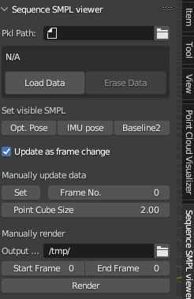
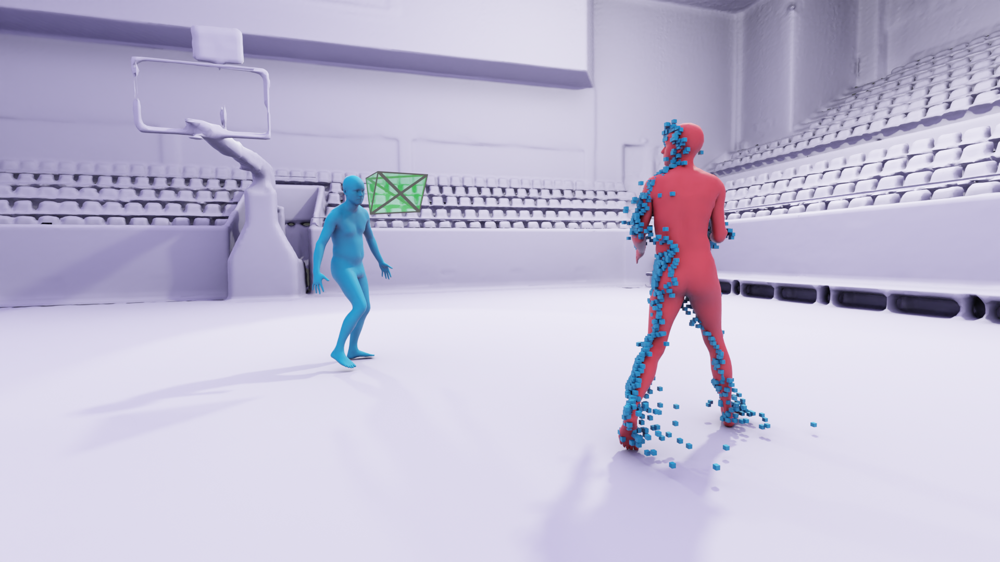

# How to Use Blender to render our results

You can follow the instruction [here](https://www.silviasellan.com/posts/blender_figure/) to learn basic Blender instructions.

## Convert our pkl file
```
python pkl2blender.py /path/to/pkl
``````

## Install the add_on

1. In blender `Edit -> Preferences -> Add-ons -> Install`
2. Choose file `Sequence_smpl_viewer.py`
3. Press 'N' and find the add-on at the sidebar
<div align="center">
  
</div>

## Render
1. Input or choose the converted pkl file's path
2. Press the button `Load Data` and you will see the results!
    <div align="center">
      
    </div>

3. Select the `Start Frame` and `End Frame` and Press the button `Render`
4. Convert the images to video with `convert_imgs.sh`
5. You need to import the materials [here](https://www.silviasellan.com/images/blender-tutorial/template.blend) to make diferent SMPL colors.
6. You need to manually set the light in blender.